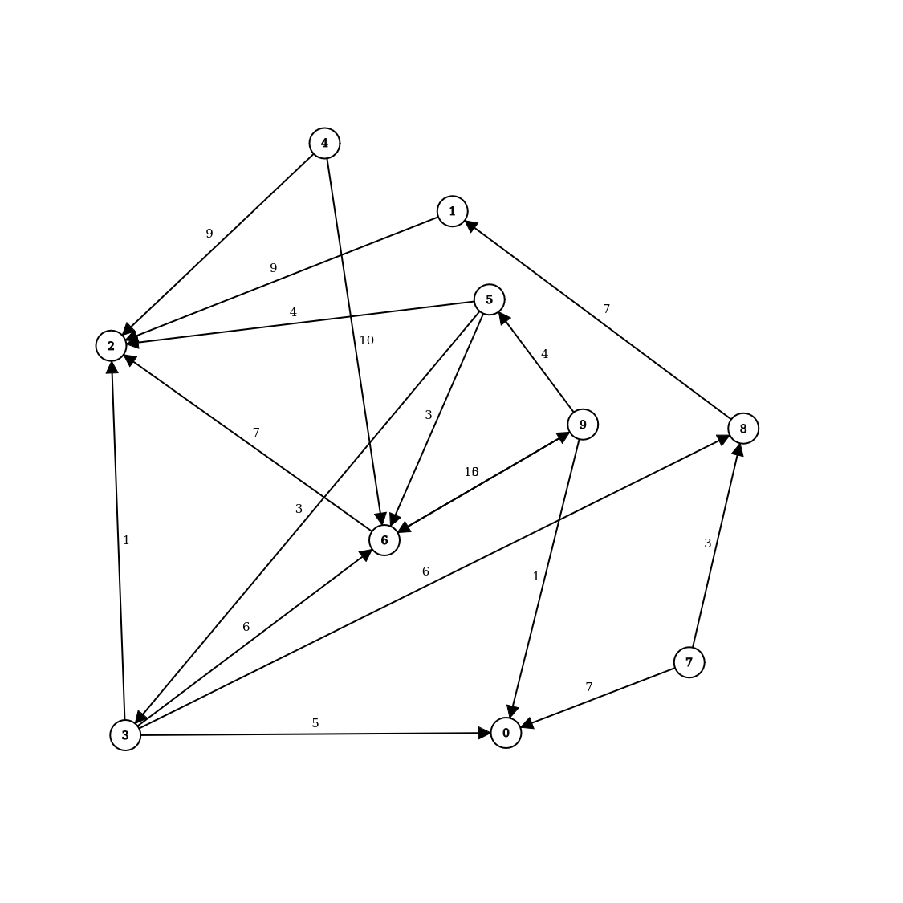
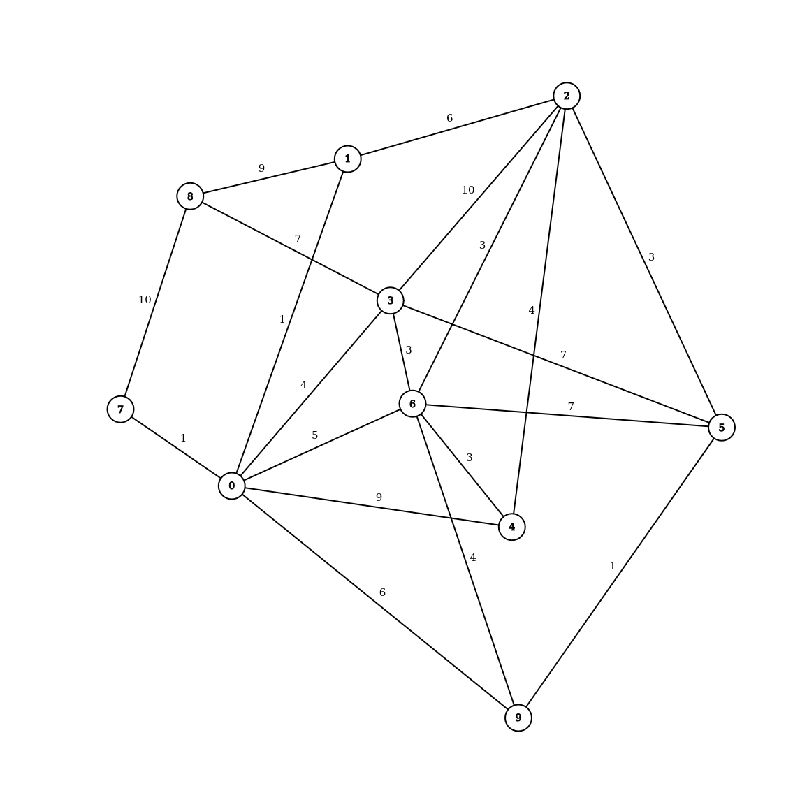

# Graphe FISA
## Auteurs
- Marc Blanchet
- Louis Bruneteau

## Emplacement des méthodes
- `src/test/java` contient des tests unitaires junit sur le TP1, exécutables avec `mvn test`
- `src/main/java/GraphAlgorithms/GraphToolsList.java` contient les parcours en largeur, en profondeur, les composantes fortement connexes et la méthode de Dijkstra. Les tests sont dans la méthode `main()` de la classe et s'affichent en ligne de commande.
- `src/main/java/GraphAlgorithms/BinaryHeap.java` contient la structure de tas binaire avec des entiers. Les tests sont dans le `main()`.
- `src/main/java/GraphAlgorithms/BinaryHeapEdge.java` contient la structure de tas binaire avec des arêtes. Les tests sont dans le `main()`. La classe contient également la méthode de Prim pour les arbres couvrants.

## Graphe utilisé dans GraphToolsList

## Graphe utilisé dans BinaryHeapEdge
